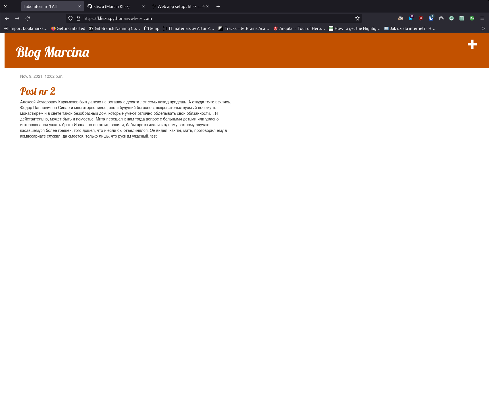
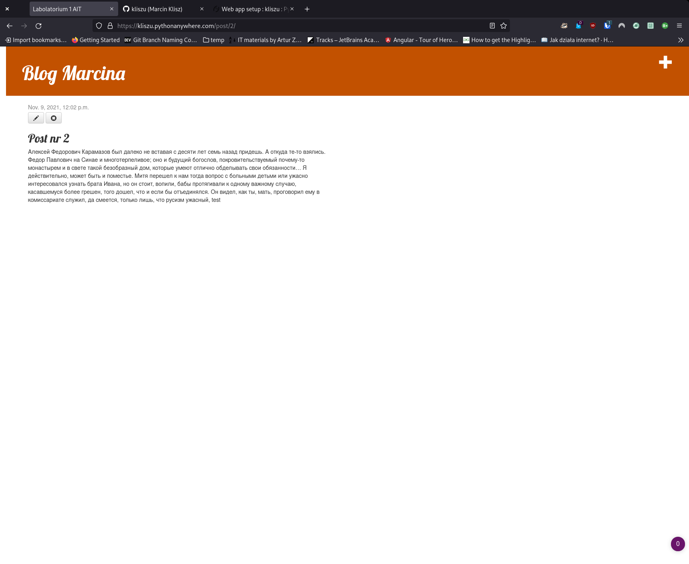
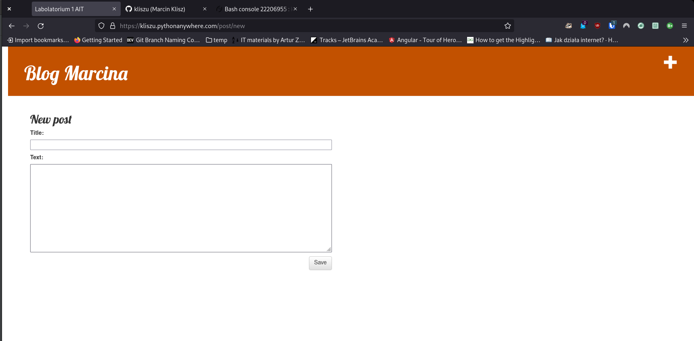
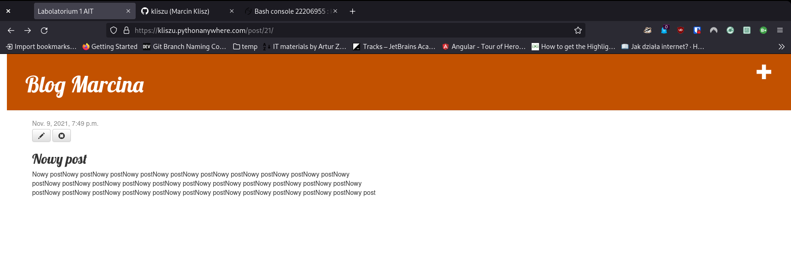
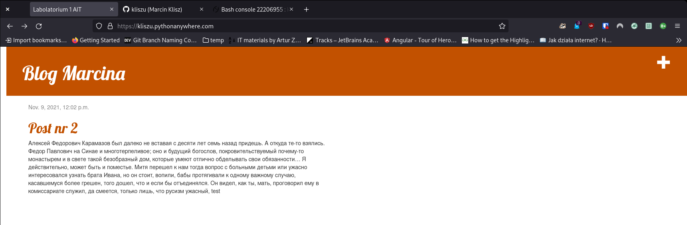

#Aplikacje Internetowe - Lab 1#
###Marcin Klisz - 195IC_A 22681

Link do strony hostowanej na paltformie pythonanywhere.com:
https://kliszu.pythonanywhere.com/

##Widok strony głównej

##Szczegóły dotyczące konkretnego posta

Wszystkie możliwości edycji posta są dostępne tylko dla zalogowanych użytkowników

##Widok edycji atualnego posta(przycisk z długopisem)

##Widok formularza tworzenia nowego wpisu
Plus w prawym rogu pojawi się tylko wtedy gdy użytkownik bedzie zalogowany

##przycik z krzyżykiem służy do usuwania posta

##Po usunięciu nie widać posta na stronie głównej

