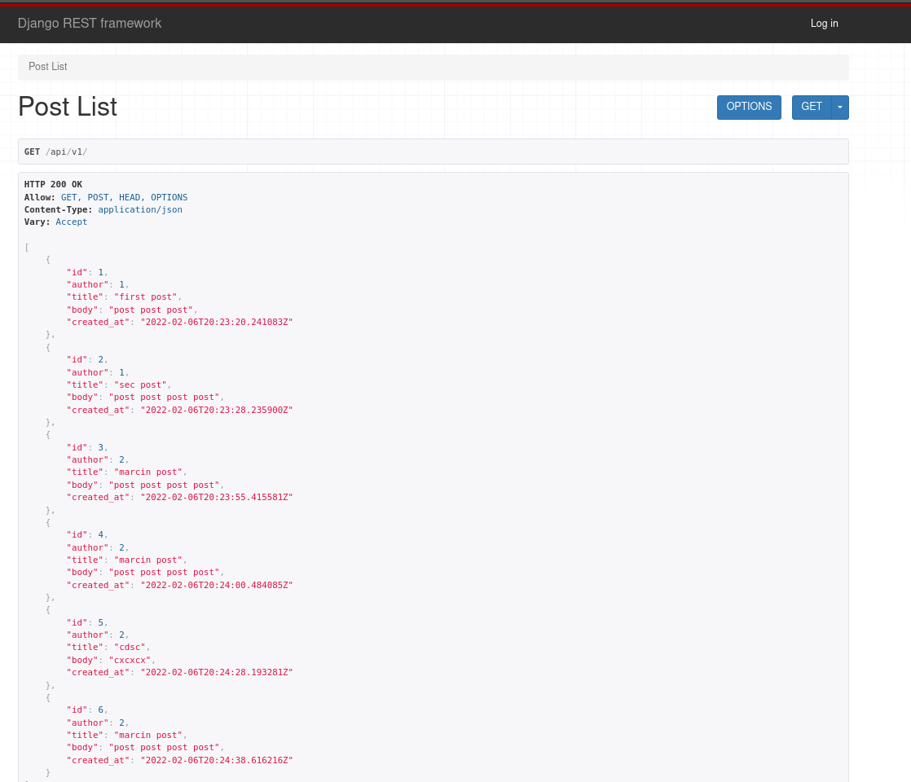
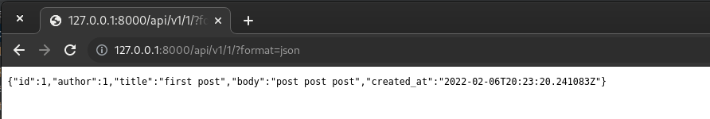
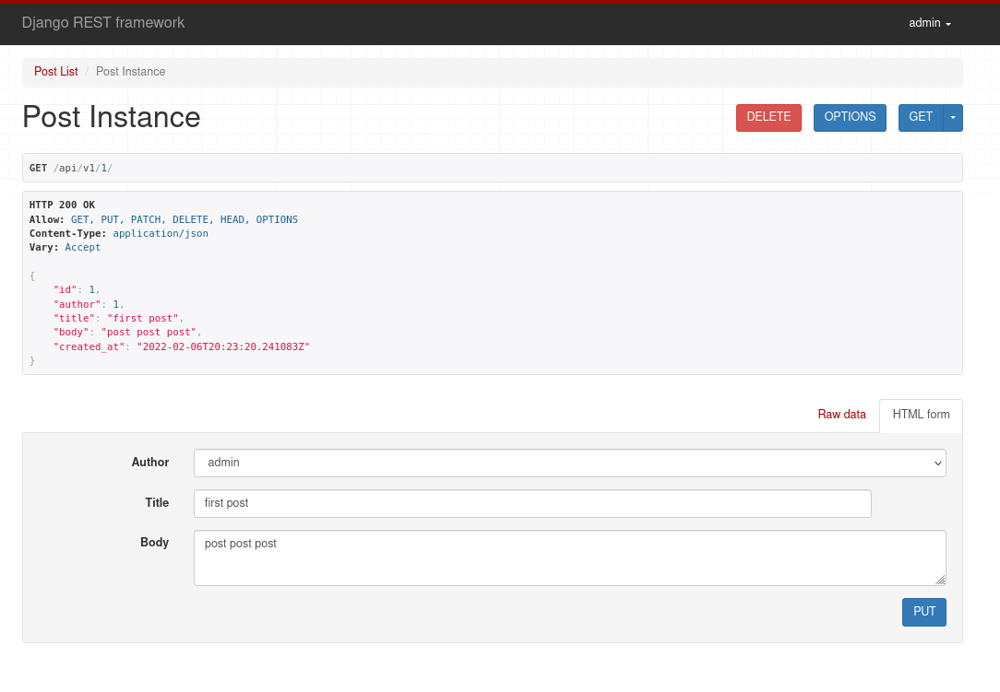
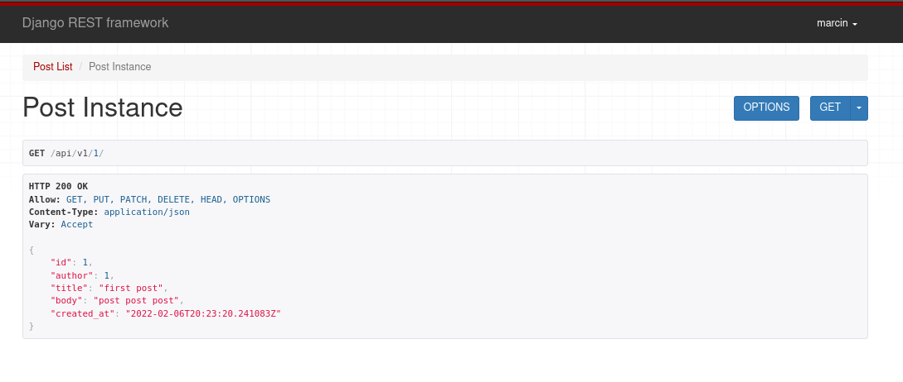
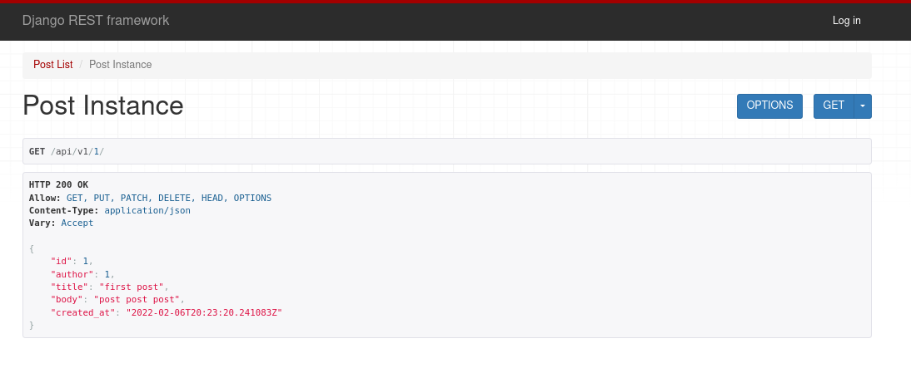
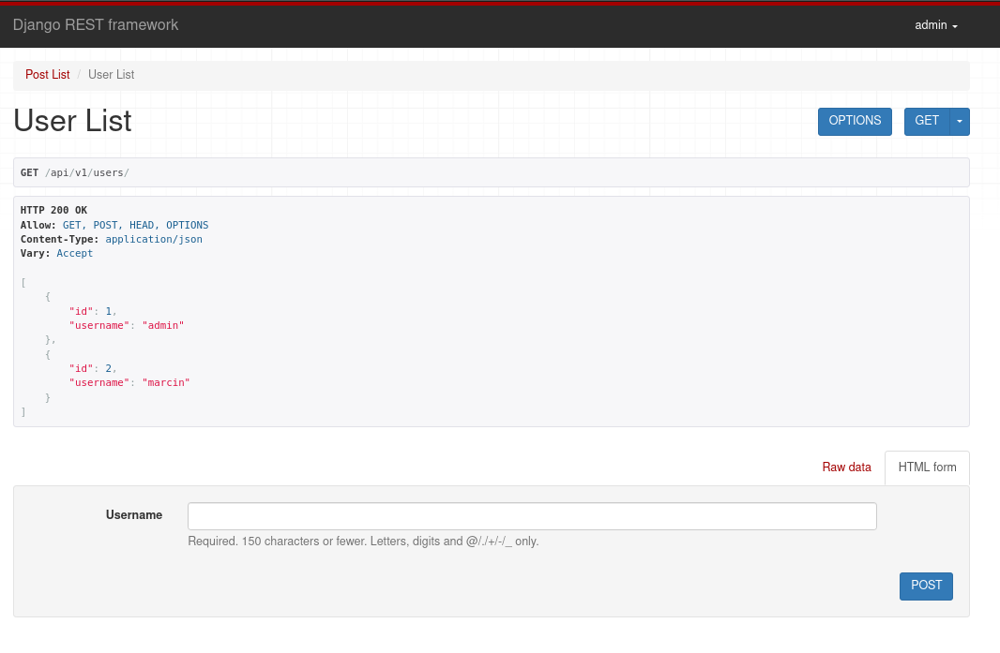
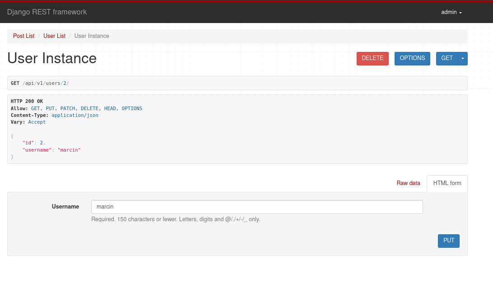
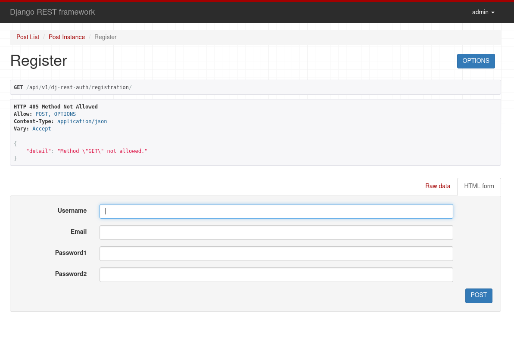

<h1>Lab 4 - BlogAPI DRF</h1>

<h3>Widok wszystkich postów</h3>

<h3>Można wyświetlić dane również w formacie json</h3>

Niezalogowany użytkownik ma dostęp do podglądu postów i użytkowników ale nie ma możliwości ich edycji.

<h3>Edycja istniejącego posta jest możliwa tylko przez autora</h3>

Jak widzimy tylko admin - autor posta, może go edytować

<h3>Lista wszystkich użytkowników</h3>

<h3>Widok pojedyńczego użytkownika</h3>

<h3>Rejestracja nowego użytkownika</h3>

<h3>Dokumentacja</h3>

Pod adresem /redoc/ jest dostępna dokumentacja naszego api

<h3>Swagger</h3>

Swagger został poprawnie skonfigurowany

